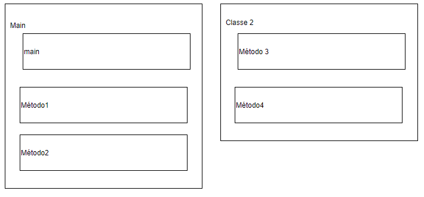

# Princípios da Programação em Java

A linguagem Java é considerada como sendo de baixo nível, ou seja, sua programação (e consequentemente sua leitura) não é trivial como se estivéssemos escrevendo um livro. Ela se apresenta como sendo uma linguagem muito burocrática e que necessita de diversos processos para que funcione corretamente. Um código em Java sempre deverá ser montado com uma estrutura semelhante a apresentada na figura abaixo.



Um código é geralmente composto por Classes e Objetos. Esses pontos serão explicados nas subseções a seguir.

## Classes

As classes de programação são receitas de um objeto, aonde têm características e comportamentos, permitindo assim armazenar propriedades e métodos dentro dela. Uma classe geralmente representa um substantivo, por exemplo uma pessoa, um lugar ou um sistema.

Vamos imaginar uma universidade. Ela é composta por diversas classes: alunos, professores, prédios, salas de aula. Note que uma classe pode ser parte de uma outra classe, ou seja, todas as classes apresentadas fazem parte de uma classe maior chamada de universidade. Mas afinal, o que diferencia uma classe da outra? A diferenciação, além do nome dado, está nos objetos que compõe a classe.

## Objetos

Objetos são caracterizados por atributos e métodos e são características definidas pelas classes.

### Atributos ou Propriedades

Atributos são as características de um objeto. Essas características também são conhecidas como variáveis. Utilizando o exemplo dos cães, temos alguns atributos, tais como: cor, peso, altura e nome.

### Métodos

Métodos são as ações que os objetos podem exercer quando solicitados, onde podem interagir e se comunicarem com outros objetos. Utilizando o exemplo dos cães, temos alguns exemplos: latir, correr, pular.

## Variáveis

Variáveis são uma forma de salvar informações no computador. As variáveis que nós armazenamos em um programa são acessadas pelo nome que nós atribuímos a elas.

Uma variável pode ter seu valor alterado ao longo do programa, ou seja, seu valor é variável. É apenas necessário informar ao computador qual o tipo de informação será armazenado e, então, dar um nome ao valor. Existem muitos tipos de dados que podem ser utilizados para definir uma variável. Os principais estão listados abaixo.

```{r, echo=FALSE}
library(tibble)
library(knitr)
tabela <- tibble("Tipo" = c("int", "double", "boolean",
                            "String", "char"),
                 "Descrição" = c("Números Inteiros", "Números Decimais",
                                 "Armazena apenas 'Verdadeiro' ou 'Falso'",
                                 "Frases", "Caracteres"))
kable(tabela,  
      caption = "Tipos de Variáveis")
```

Existem diversos outros tipos de variáveis, que serão apresentados com maior detalhe nas seções seguintes.

## Criando o primeiro código em Java

A primeira etapa para a criação de um código em Java é a criação de uma classe. Por padrão, a classe principal do seu programa se chama “Main”.

```{java}
public class Main{
  //Oi! Eu sou uma classe!
}
```
Perceba alguns pontos importantes:

- O código inicia com a palavra “*public*”. Isso indica que sua classe pode ser encontrada por outras classes que estiverem salvas no mesmo diretório. Você pode alterar por “*private*” ou “*protected*”;
- Há a presença de chaves `{ }` no código. Isso é uma burocracia da linguagem. A classe é correspondente ao que está dentro das chaves. Tudo o que estiver fora delas não será considerado como parte do código;
- Para fazer comentários em Java, usa-se duas barras `//` .

Agora que temos a nossa classe criada, necessitamos criar os objetos. Por agora vamos criar apenas um método.

```{java}
public class Main{
  public static void main(String[] args){
    System.out.println("Hello World!");
  }
}
```

Agora, dentro da nossa classe foi criado o método main. Isso também segue um padrão imposto pela linguagem. Há, novamente, alguns pontos que merecem destaque.

- A função “System.out.println()” é utilizada para escrever algum texto no console;
- Todas as linhas de código devem ser terminadas com um ponto e vírgula.

Colocando este código para correr, deverá aparecer no console a mensagem “*Hey, Hello World*!”. Pronto! Você acaba de criar seu primeiro código!


### Criando Variáveis

Working on it! :)