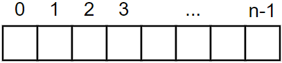

# Vetories, Listas e Coleções

Muitas vezes em programação temos que trabalhar com conjuntos de valores em conjunto. Para isso é possível utilizarmos as ferramentas de vetores e listas. Esses conjuntos têm diversas semelhanças e diferenças entre si. Isso impacta diretamente na escolha de qual delas deve ser utilizada no código. Aqui serão apresentadas cada uma delas e suas particularidades.

Imagine uma fila. Nela existem várias pessoas em uma determinada sequência. Há posições nessa fila e as pessoas estão ordenadas de acordo com uma ordem específica (por nome, idade, ordem de chegada, enfim, qualquer ordem). Assim funcionam os vetores. Os vetores funcionam como “filas” onde cada elemento está posicionado em uma determinada posição.

Em Java, diferentemente de outras linguagens de programação (R, por exemplo), a contagem de posições começa no 0. Ou seja, um vetor com 10 posições tem sua primeira posição em 0 e sua última posição em 9 (contabilizando, assim, posições). Uma representação gráfica é apresentada abaixo.



## Arrays

As *arrays* são objetos que armazenam valores. Esse tipo de vetor tem um número fixo de posições que é determinado no momento de sua criação. Eles podem armazenar qualquer tipo de variável ou objeto. A estrutura de código para criar uma *array* é apresentada abaixo.

```
tipo[ ] nome = new tipo[tamanho]
```

Diversos pontos devem ser considerados para criar uma *array*:

- Toda *array* deve ter um tipo. Isso significa que todos os elementos da *array* deverão ser do mesmo tipo, e.g., uma array do tipo `int[ ]` receberá apenas valores inteiros;
- Toda *array* depende de um tamanho. Esse tamanho é determinado no momento da criação da *array* por meio do termo `tamanho`.

Abaixo temos alguns exemplos de `arrays`.

```{java}
int[] inteiros1 = new int[5];
double[] decimais = new  double[7];
String[] strings = new String[10];
float[] floats = new float[3];
```

Todas as *arrays* acima tem um tamanho determinado (os tamanhos são 5, 7, 10 e 3, respectivamente). Há uma forma de se criar uma *array* com todos os valores, conforme apresentado abaixo.

```{java}
int[] inteiros2 = {0,1,2,3,4};
```

Da mesma forma que o vetor `inteiros1`, a *array* `inteiros2` tem 5 posições. A diferença de uma forma para a outra é que, a primeira *array* não possui valores pré-alocados, enquanto da segunda as posições já contam com valores pré-determinados.

#### Acrescentando ou Mudando Valores

Para acrescentar ou modificar um valor em uma posição deve-se indicar exatamente para qual posição cada valor deve ser alocado.

```{java}
int[] inteiros = {0,1,2,3,4};
inteiros[0] = 10;
// inteiros == {10,1,2,3,4}
```

No exemplo acima, o valor na posição `0` (de valor 0) foi substituído por 10.

#### Acessando Valores

De forma semelhante, para acessar um valor em uma *array* basta indicar a posição desejada.

```{java}
int[] inteiros = {0,1,2,3,4};
int inteiro = inteiros[3];
//inteiro == 3;
```

### Valores e Referências

Corra o código abaixo. O que acontece?

```{java}
public class Main {

    public static void main(String[] args){

        int[] inteiros1 = {48, 9, 96, 26, 10, 51};
        int[] inteiros2 = inteiros1;
        System.out.println("inteiros1 =  " + Arrays.toString(inteiros1));
        System.out.println("inteiros2 =  " + Arrays.toString(inteiros2));

        inteiros2[0] = 47;

        System.out.println("inteiros1 =  " + Arrays.toString(inteiros1));
        System.out.println("inteiros2 =  " + Arrays.toString(inteiros2));
    }
}
```

O resultado que aparece no console deve ser igual ao apresentado abaixo.

```
inteiros1 =  [48, 9, 96, 26, 10, 51]
inteiros2 =  [48, 9, 96, 26, 10, 51]
inteiros1 =  [47, 9, 96, 26, 10, 51]
inteiros2 =  [47, 9, 96, 26, 10, 51]
````

### Matrizes

Working on it :)

## Listas

Working on it :)

## Exercícios {-}

Working on it :)